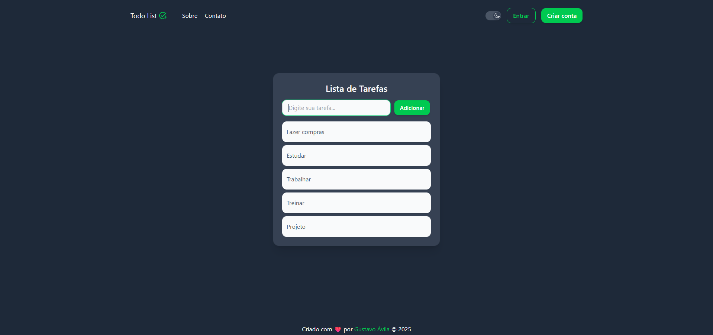

# 📝 Todo List App

Web application for task management with authentication system. Allows users to register, log in, create, edit, and delete tasks.

## 📸 Preview



---

## 🛠️ Technologies

**Frontend:**
- React.js
- Tailwind CSS
- Axios
- React Router
- JWT Decode
- Framer Motion

**Backend:**
- Node.js
- Express.js
- PostgreSQL
- Bcrypt
- JSON Web Token (JWT)
- Dotenv

---

## 🚀 Features

- User registration with automatic login
- Login with session persistence via JWT
- Logout with token removal
- Form validation
- Task creation, editing, deletion, and listing
- Tasks linked to authenticated user
- Protected routes with middleware

---

## 📁 Folder Structure

```bash
.
├── backend
│   ├── controllers
│   ├── db.js
│   ├── middleware
│   ├── models
│   ├── routes
│   └── index.js
├── frontend
│   ├── src
│   │   ├── assets
│   │   ├── components
│   │   ├── context
│   │   ├── pages
│   │   ├── services
│   │   ├── App.jsx
│   │   └── main.jsx
│   └── public
│   └── index.html
```

---

## ⚙️ How to Run Locally

1. Clone the repository:
```bash
git clone https://github.com/your-username/your-repo.git
cd your-repo
```

2. Set up the **backend**:
```bash
cd backend
cp .env.example .env # or create your own .env file
npm install
npm run dev
```

> Required variables in `.env`:
```env
PG_USER=""
PG_HOST=""
PG_DATABASE=""
PG_PASSWORD=""
PG_PORT=""

JWT_SECRET=your_secret_key
```

3. Set up the **frontend**:
```bash
cd ../frontend
npm install
npm run dev
```

---

## 📌 TODO

- [ ] Task filter (completed/pending)
- [x] Dark Mode
- [ ] Deploy on Vercel and Render

---

## 🧑‍💻 Author

**Gustavo**  
Bachelor in Information Systems, focused on frontend web development.

## 📄 License

This project is open source and available under the [MIT License](LICENSE).